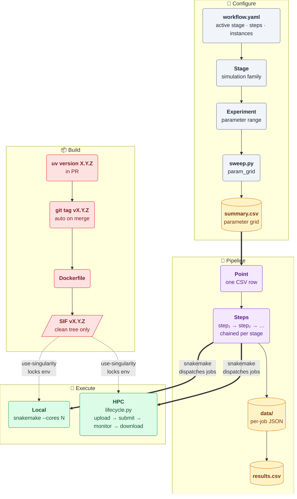

# Architecture

```mermaid
%%{init: {
  "flowchart": {
    "htmlLabels": true,
    "nodeSpacing": 30,
    "rankSpacing": 50,
    "diagramPadding": 0
  }
}}%%
flowchart TB

%% ─── ① CONFIGURE ───────────────────────────
subgraph CFG["🧩 Configure"]
    direction TB

    WFY("<strong>workflow.yaml</strong><br/>active stage · steps · instances")
    STAGE("<strong>Stage</strong><br/>simulation family")
    EXP("<strong>Experiment</strong><br/>parameter range")
    SWEEP("<strong>sweep.py</strong><br/>param_grid")

    GRID[(<strong>summary.csv</strong><br/>parameter grid)]

    WFY --> STAGE --> EXP --> SWEEP --> GRID
end


%% ─── ② PIPELINE ────────────────────────────
subgraph PIPE["🔧 Pipeline"]
    direction TB

    POINT("<strong>Point</strong><br/>one CSV row")
    STEPS("<strong>Steps</strong><br/>step₁ → step₂ → …<br/>chained per stage")

    DATA[(<strong>data/</strong><br/>per-job JSON)]
    RES[(<strong>results.csv</strong>)]

    POINT --> STEPS --> DATA --> RES
end


%% ─── ③ EXECUTION ───────────────────────────
subgraph EXEC["🚀 Execute"]
    direction TB

    LOCAL("<strong>Local</strong><br/>snakemake --cores N")
    HPC("<strong>HPC</strong><br/>lifecycle.py<br/>upload → submit → monitor → download")
end


%% ─── ④ BUILD ───────────────────────────────
subgraph BUILD["📦 Build"]
    direction TB

    BUMP("<strong>uv version X.Y.Z</strong><br/>in PR")
    TAG("<strong>git tag vX.Y.Z</strong><br/>auto on merge")
    DOCK("<strong>Dockerfile</strong>")
    SIF[/"<strong>SIF vX.Y.Z</strong><br/>clean tree only"/]

    BUMP --> TAG --> DOCK --> SIF
end


%% ─── CROSS-ZONE FLOW ───────────────────────
GRID ==> POINT

STEPS == "snakemake \n dispatches jobs" ==> LOCAL
STEPS == "snakemake \n dispatches jobs" ==> HPC

SIF -. "use-singularity<br/>locks env" .-> LOCAL
SIF -. "use-singularity<br/>locks env" .-> HPC


%% ─── STYLES ────────────────────────────────
classDef cfg      fill:#e0f2fe,stroke:#0284c7,color:#0c4a6e
classDef pipe     fill:#f3e8ff,stroke:#9333ea,color:#581c87
classDef build    fill:#fee2e2,stroke:#dc2626,color:#7f1d1d
classDef exec     fill:#dcfce7,stroke:#16a34a,color:#14532d
classDef data     fill:#fef3c7,stroke:#d97706,color:#78350f
classDef config   fill:#f1f5f9,stroke:#64748b,color:#1e293b

class WFY,STAGE,EXP,SWEEP config
class POINT,STEPS pipe
class LOCAL,HPC exec
class BUMP,TAG,DOCK,SIF build
class GRID,DATA,RES data
```
